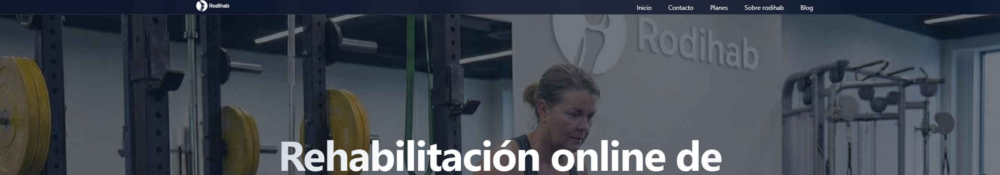

# 🦵 Rodihab | Landing Page de Fisioterapia Online

 

Una landing page moderna, totalmente responsiva y optimizada para SEO, diseñada para **Rodihab**, un servicio de rehabilitación online especializado en lesiones de rodilla (LCA y Menisco). 

Este proyecto destaca por su interfaz dinámica y su **"Scrollytelling"** fluido, logrado puramente con las nuevas especificaciones de CSS (Scroll-driven animations) sin depender de librerías externas de JavaScript.

🔗 **[Ver Demo en Vivo](https://landing-rodihab.vercel.app/)**


---


## ✨ Características Principales

* 🚀 **Scroll-Driven Animations:** Animaciones complejas y revelado de elementos vinculadas al scroll del usuario utilizando `animation-timeline`.
* 📱 **Diseño Responsive:** Adaptación perfecta a dispositivos móviles, tablets y escritorio. Menú hamburguesa interactivo en CSS puro.
* 🔍 **SEO Optimizado:** Etiquetas Open Graph para redes sociales, Meta descriptions y marcado de datos estructurados (`schema.org`) para clínicas médicas y FAQs.
* 🎨 **UI/UX Moderna:** Uso de variables CSS, efecto Glassmorphism (backdrop-filter), modo sticky para las secciones informativas y navegación lateral interactiva (Side Nav).
* ⚡ **Performance:** Sin dependencias externas pesadas. Maquetación pura en HTML5 y CSS3.


---


## 🛠️ Tecnologías Utilizadas

  


---


## 📂 Estructura del Proyecto

```text
Landing-rodihab/
├── 📁 assets/
│   ├── 📁 favicons/       # Iconos de la pestaña del navegador
│   └── 📁 images/         # Imágenes, logos y recursos gráficos
├── 📁 css/
│   └── 📄 style.css       # Estilos globales, variables y animaciones
├── 📁 pages/
│   ├── 📄 blog.html
│   ├── 📄 contacto.html
│   └── 📄 planes.html
├── 📄 404.html            # Página de error personalizada
├── 📄 index.html          # Landing page principal
├── 📄 robots.txt          # Directivas para rastreadores web
└── 📄 sitemap.xml         # Mapa del sitio para SEO

💻 Instalación y Uso Local

Si quieres clonar este repositorio y probarlo en tu entorno local:

1. Clona el repositorio:

```bash
git clone [https://github.com/davidValades/Landing-rodihab.git](https://github.com/davidValades/Landing-rodihab.git)
```

2. Abre la carpeta del proyecto:

```bash
cd Landing-rodihab
```

3. Abre el archivo index.html en tu navegador o utiliza la extensión Live Server de VS Code.

⭐ Proyecto desarrollado por [David Valadés Navarro](https://github.com/davidValades).